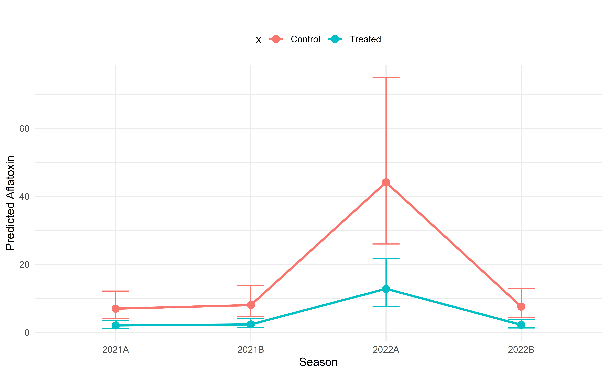

##
**<h1>Repository for modeling aflatoxin prevalence in maize using data collected in Uganda for the years 2021 and 2022.</h1>**

We used a Generalized Linear Mixed Model (GLMM) with a Tweedie distribution to analyze the effects of various predictors on aflatoxin prevalence.

***Model Specification***

*Predictors:* Altitude, Season, Treatment, and the interaction between Altitude and Treatment.

*Random Effects:* Districts nested within Regions.

***Hypotheses:***

<li>Treated farms will have lower aflatoxin prevalence compared to untreated farms.</li>
<li>Aflatoxin prevalence will vary significantly by season, region, and district.</li>
<li>Higher-altitude farms (likely wetter areas) may have higher aflatoxin prevalence due to increased fungal growth conditions.</li>
<li>The effectiveness of treatment might depend on altitude (i.e., we expected a potential interaction effect).</li>

***Preliminary Findings:***

<li>Treatment significantly reduces aflatoxin prevalence (*p* < 0.001) and there is a significant seasonal variation in aflatoxin prevalence confirming that different growing conditions across seasons impact contamination levels.</li>

<li>The interaction between Altitude and Treatment is not significant (p = 0.414), indicating that the effect of treatment is consistent across different altitudes i.e., altitude does not influence how well the treatment works.</li>
<li>Altitude alone is not a significant predictor (p = 0.127), suggesting that it may not strongly influence aflatoxin prevalence as initially expected.</li>
<li>Significant variability exists at the district and regional levels, indicating that localized environmental or management factors may play a role in aflatoxin contamination.</li>

These findings highlight that treatment is effective regardless of altitude, and aflatoxin prevalence is highly dependent on seasonality. Further analysis will explore additional environmental and management factors that may contribute to these trends.

